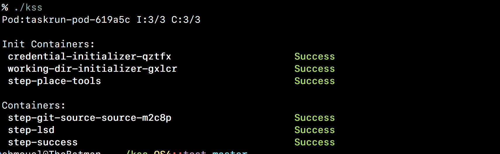
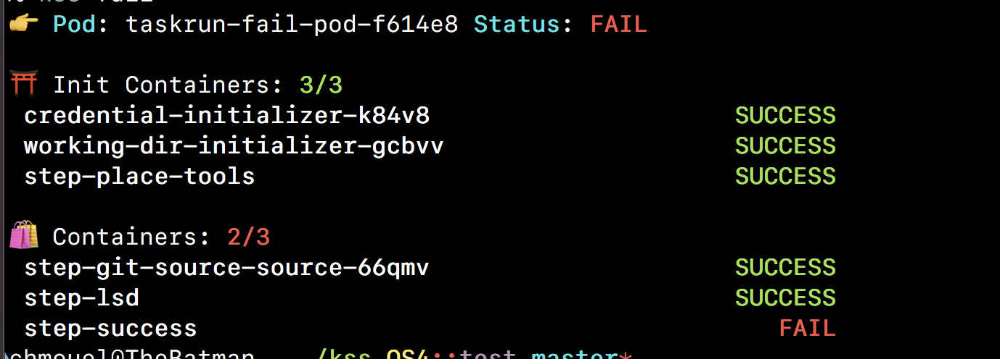
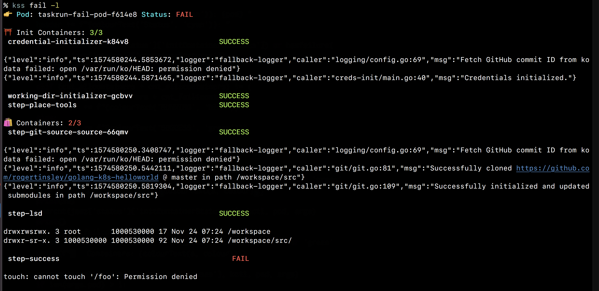

# KSS - Kubernetes pod status on steroid

A simple tool to show the current status of the pod and its associated `containers` and `initContainers`.

You can specify the pods to get status for arguments if you don't it will launch [fzf](https://github.com/junegunn/fzf) and let choose it (or select automatically the first available if there is only one), use the [TAB] to select multiple pods.

If you specify the `-l` option it will shows the output log as well, you can adjust how many line of th log you like with the `--maxlines=INT`.

You can use the `-r` option with a regexp to restrict the status (or the log output) to certain containers.

## Install

You just make sure you have >python3.6, fzf and kubctl. Just download the [script](https://raw.githubusercontent.com/chmouel/kss/master/kss) directly into your path. I may do a [krew](https://github.com/kubernetes-sigs/krew) plugin if this get popular enough.

With zsh you can install the [_kss](./_kss) completionfile  to your [fpath](https://unix.stackexchange.com/a/33898).

## Screenshots

### Success run

### Failed run

### Failed run with logs

### Selecting a pod with fzf

