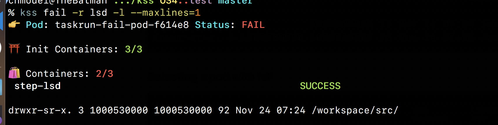

# KSS - Kubernetes pod status on steroid 💉

A simple tool to show the current status of a pod and its associated `containers` and `initContainers`.

This was developed out of frustration with `kubectl get pod` not showing much and `kubectl describe pod` showing way too much in a cryptic way. Debugging failed pods with a lot of `initContainers` and `sideCars` usually was done with `kubectl get pod -o yaml |less` with a lot of going up and down over a pager to figure out what's going on and a bunch of swearing 🔞. All those techniques for introspection and debugging are still useful and **KSS** is not planning to fully replace them but now thanks to it you can see quickly what happen and what fails and get your saninty back 😅.

## Usage

You can specify a pod or multiple ones as argument to **KSS**, if you don't it will launch the lovely [fzf](https://github.com/junegunn/fzf) and let you choose the pod interactively, if there is only one pod available it will select it automatically. If you would like to choose multiple pods you can use the key [TAB]  and select them, **KSS** will then show them all.

**KSS** shows a preview when running with fzf, it will try to do the preview with itself if it cannot find itself in the `PATH` it will fallback to a good ol' and boring `kubectl describe` 👴🏼👵🏻.

If you add the `-l` option it will show you the log output of the container, you can adjust how many lines of the log you want to see if you add the flag `--maxlines=INT`.

You can use the `-r` option if you would like to restrict it to only some containers, it accepts a regexp as an argument, so you can do some fancy matching in there. You would typically use this flag combined when you are outputting the container's log (`-l`).

## Install

### Packages

#### Homebrew

You can install **KSS** latest with homebrew, you just have to fire up those
commands in your shell and **KSS** and its zsh completions will be installed :

```shell
brew tap chmouel/kss
brew install kss
```

This has been tested as working on [linuxbrew](https://docs.brew.sh/Homebrew-on-Linux) too.

### Manual install

You just make sure you have >=Python3.6, [fzf](https://github.com/junegunn/fzf) and kubectl. You then can download the [script](https://raw.githubusercontent.com/chmouel/kss/master/kss) and put it directly into your `PATH` or checkout this GIT repo and link the binary into your path so you can have do some git pull to get the updates.

With zsh you can install the [_kss](./_kss) completionfile  to your [fpath](https://unix.stackexchange.com/a/33898).

### Misc

I may do a [krew](https://github.com/kubernetes-sigs/krew) plugin if this get [requested](https://github.com/chmouel/kss/issues/1) enough. Watch this space as cool people would say 😎🏄🤙.

## Screenshots

### Success run


### Failed run


### Failed run with logs


### Restrict the logs output only to a container and only to one line with the -r and --maxlength flags



### Selecting a pod with fzf

[](https://asciinema.org/a/xOCUspvH0z5R2y56jtN32Xk6G)


## Misc

* The code is getting quite tortured, like some sort of spaghetti plate 🍝 with greasy meatballs 🥩 on the top, the kind of stuff you start to write quickly and dirty out of frustration to fix a problem and it grows it grows until it really become an unreadable beast. I probably going to rewrite it up properly with tests and all (in a compiled language perhaps?) soonish enough. But hey who cares, since it kinda works! (until I broke it :D) 😅
