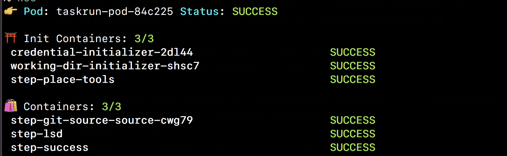
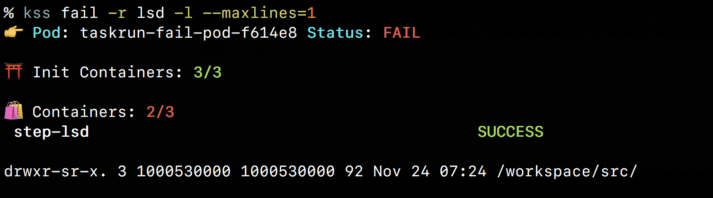

# KSS - Kubernetes pod status on steroid

A simple tool to show the current status of the pod and its associated `containers` and `initContainers`. This was developed out of frustration with `kubectl get pod` not showing much and `kubectl describe pod` showing way too much in a cryptic way. Debugging failed pods with a lot of `initContainers` and `sideCars` usually was done with `kubectl get pod -o yaml |less` wiht a lot of going up and down and a bunch of censored swearing 🔞. All those techniques for introspection and debugging are still useful  and KSS is not planning to replace them but now thanks to **KSS** I swear less 😅

## Usage

You can specify a pod or multiple ones as argument to **KSS**, if you don't it will launch [fzf](https://github.com/junegunn/fzf) and let you choose it interactively, if there is only one available it will select it automatically, if you would like to choose multiple pods you can use the key [TAB]  and select them. 

KSS shows a preview when running with fzf, it will preview itself if it can find itself in the `PATH` or if it cannot find itself in the `PATH` it will fallback to a boring ol' `kubectl describe` 👴🏼👵🏻.

If you specify the `-l` option it will show the output log as well of the container, you can adjust how many line of the log you want to see with the flag `--maxlines=INT`.

You can use the `-r` option if you would like to restrict it to only some containers, it accepts a regexp as an argument, so you can do some fancy matching in there. You would typically use this flag when outputting the log (`-l`)

## Install

You just make sure you have >=Python3.6, [fzf](https://github.com/junegunn/fzf) and kubectl. You then can download the [script](https://raw.githubusercontent.com/chmouel/kss/master/kss) and put it directly into your `PATH` or checkout this GIT repo and link the binary into your path so you can have do some git pull to get the updates. 

With zsh you can install the [_kss](./_kss) completionfile  to your [fpath](https://unix.stackexchange.com/a/33898).

I may do a [krew](https://github.com/kubernetes-sigs/krew) plugin and/or brew homebrew repository if this get popular enough. Watch this space as cool people would say 🏄.

## Screenshots

### Success run

### Failed run

### Failed run with logs

### Restrict the logs output only to a container and only to one line with the -r and --maxlength flags

### Selecting a pod with fzf

## Misc

* The code is currently getting quite tortured, like some sort of spagethis plate 🍝 with greasy meatballs 🥩 on the top, the kind of stuff you start to write quickly and dirty out of frustration to fix a probleme and it grows it grows until it really become a unreadable beast. I probably going to rewrite it up properly with tests and all (in a compiled language perhaps?) soonishly enough. But hey who cares, since it kinda works! (until I broke it :D) 😅
